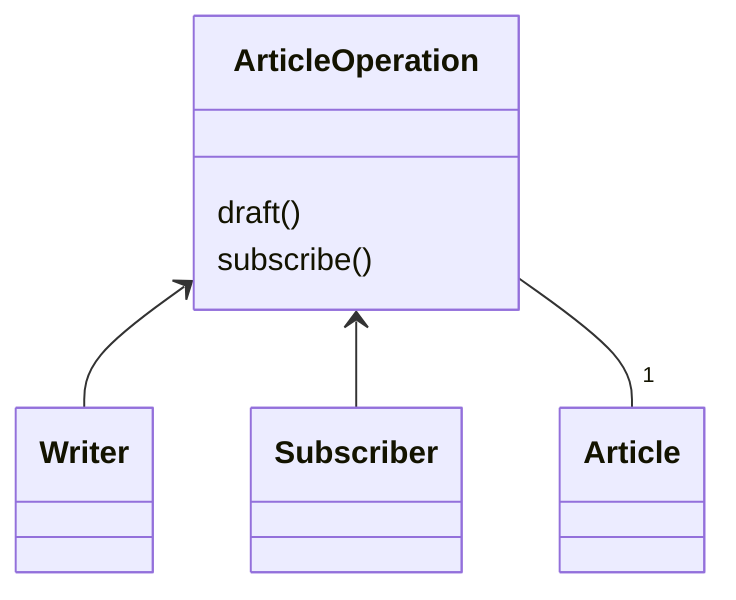

```mermaid
classDiagram
  class Writer
  class Subscriber
  class Article
  class ArticleOperation {
    draft()
    subscribe()
  }

  ArticleOperation <-- Writer
  ArticleOperation <-- Subscriber
  ArticleOperation --"1" Article
```
