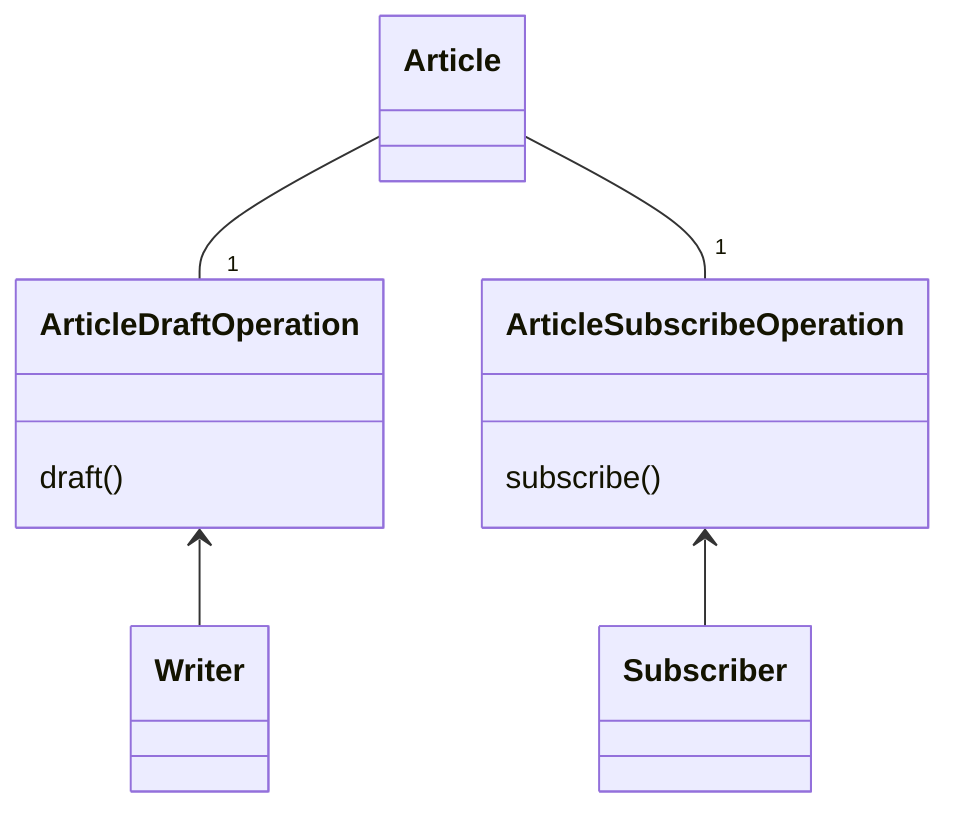

```mermaid
classDiagram
  class Writer
  class Subscriber
  class Article
  class ArticleDraftOperation {
    draft()
  }
  class ArticleSubscribeOperation {
    subscribe()
  }

  Article --"1" ArticleDraftOperation
  Article --"1" ArticleSubscribeOperation
  ArticleDraftOperation <-- Writer
  ArticleSubscribeOperation <-- Subscriber
```
