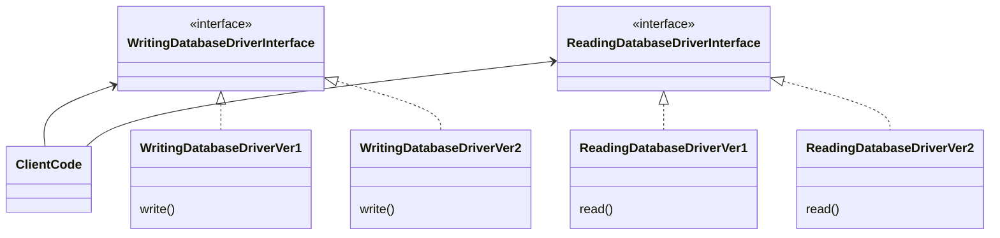

```mermaid
classDiagram
  class ClientCode
  class WritingDatabaseDriverInterface {
    <<interface>>
  }
  class ReadingDatabaseDriverInterface {
    <<interface>>
  }
  class WritingDatabaseDriverVer1 {
    write()
  }
  class WritingDatabaseDriverVer2 {
    write()
  }
  class ReadingDatabaseDriverVer1 {
    read()
  }
  class ReadingDatabaseDriverVer2 {
    read()
  }

  WritingDatabaseDriverInterface <-- ClientCode
  WritingDatabaseDriverInterface <|.. WritingDatabaseDriverVer1
  WritingDatabaseDriverInterface <|.. WritingDatabaseDriverVer2
  ReadingDatabaseDriverInterface <-- ClientCode
  ReadingDatabaseDriverInterface <|.. ReadingDatabaseDriverVer1
  ReadingDatabaseDriverInterface <|.. ReadingDatabaseDriverVer2
```

