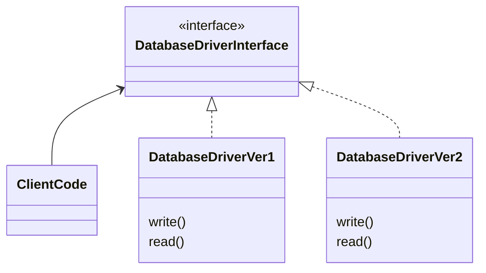

```mermaid
classDiagram
  class ClientCode
  class DatabaseDriverInterface {
    <<interface>>
  }
  class DatabaseDriverVer1 {
    write()
    read()
  }
  class DatabaseDriverVer2 {
    write()
    read()
  }

  DatabaseDriverInterface <-- ClientCode
  DatabaseDriverInterface <|.. DatabaseDriverVer1
  DatabaseDriverInterface <|.. DatabaseDriverVer2
```

