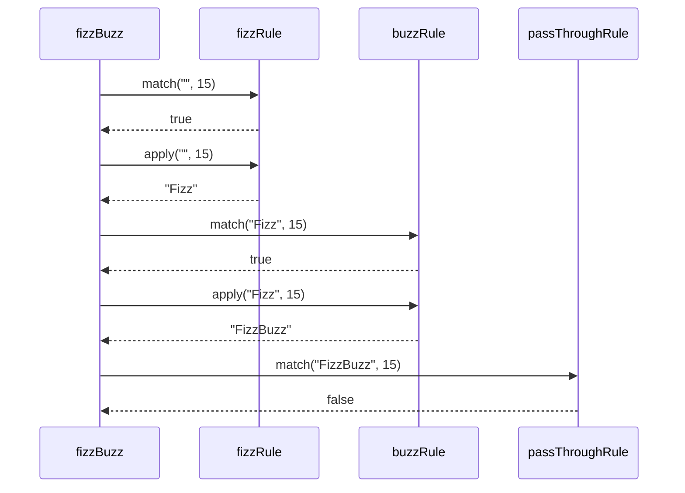

```mermaid
sequenceDiagram
  fizzBuzz ->> fizzRule: match("", 15)
  fizzRule -->> fizzBuzz: true
  fizzBuzz ->> fizzRule: apply("", 15)
  fizzRule -->> fizzBuzz: "Fizz"
  fizzBuzz ->> buzzRule: match("Fizz", 15)
  buzzRule -->> fizzBuzz: true
  fizzBuzz ->> buzzRule: apply("Fizz", 15)
  buzzRule -->> fizzBuzz: "FizzBuzz"
  fizzBuzz ->> passThroughRule: match("FizzBuzz", 15)
  passThroughRule -->> fizzBuzz: false
```
